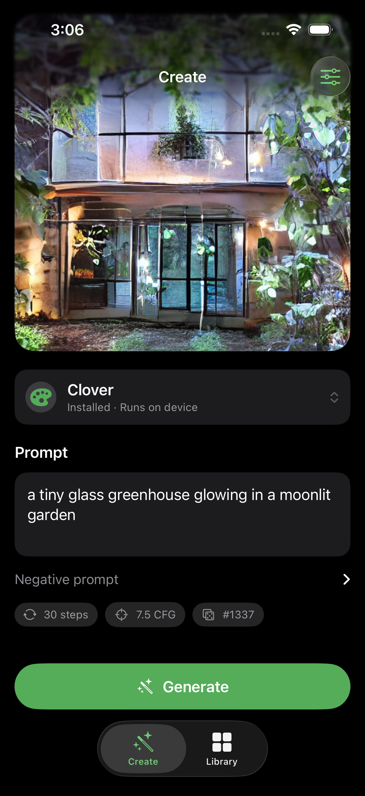
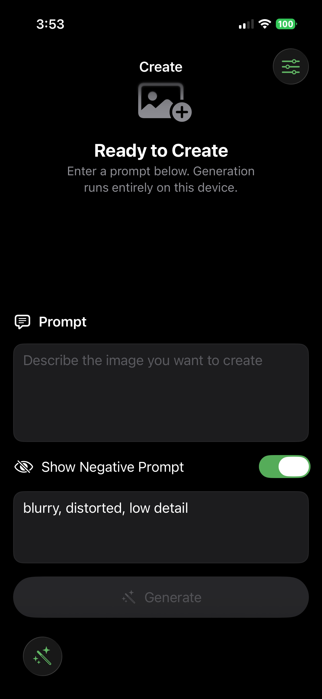
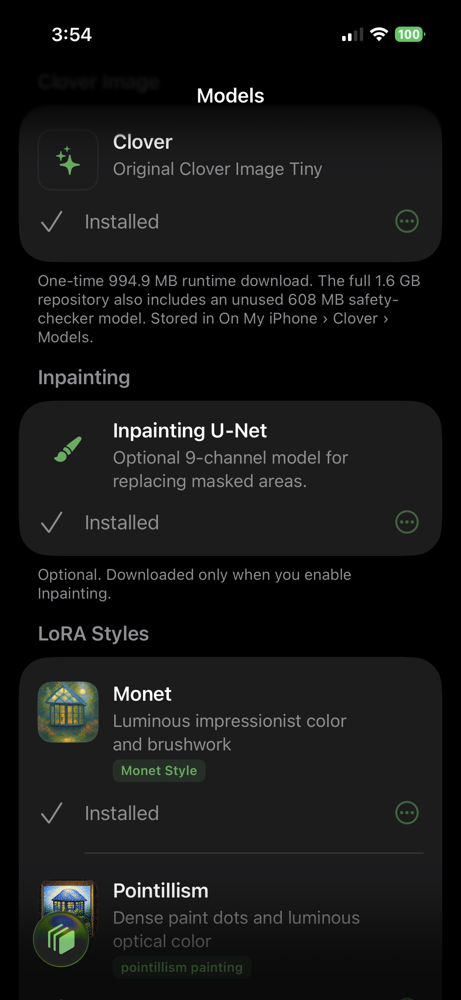
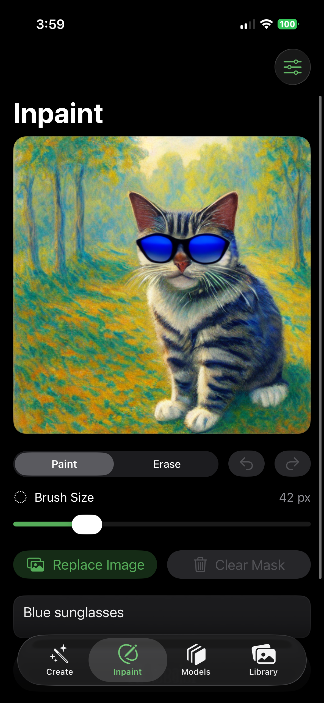
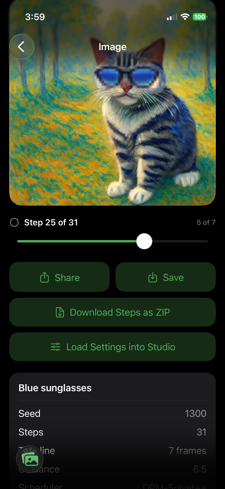
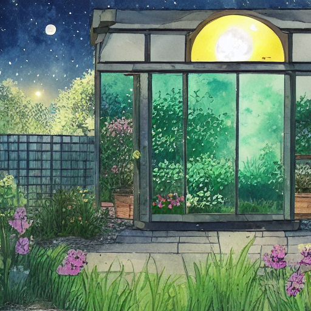

# Clover Image Tiny for iOS

Native, private image generation on iPhone with SwiftUI, Core ML, and
[Clover Image Tiny](https://huggingface.co/neonforestmist/Clover-Image-Tiny).

## Features

### Create

- Runs image generation on the device after model installation
- Prompt and negative-prompt controls
- 4–100 inference steps with both a slider and precise stepper
- Guidance from 1.0–20.0, reproducible seeds, and seed randomization
- One to four images per generation at native 512 × 512 resolution
- PNDM and DPM-Solver++ schedulers with NumPy and PyTorch-compatible random generators

### Inpainting

- Dedicated **Inpainting** tab for image selection, cropping, mask painting, and local edits
- Paint and Erase tools, adjustable brush size, Undo/Redo, and exact mask compositing
- Optional live step previews that remain attached to the finished artwork timeline

### Models and LoRA styles

- Base-first downloads: install Clover, then add only the styles you want
- Mix up to three downloaded or imported LoRAs with independent strengths
- Import a Clover-compatible `.safetensors` style from **On My iPhone → Clover → Imported Styles**
- Visible downloads in **On My iPhone → Clover → Models**
- Immutable model revisions with byte-count and SHA-256 verification

### Library and previews

- Saved generation timelines with previews every 1–10 steps
- Local artwork library, timeline scrubbing, ZIP export, and Photos export

### Apple platform integration

- Apple-style SwiftUI interface for iPhone and iPad
- iPhone slide-over sidebar; iPad split-view sidebar and parameter inspector
- Neural Engine, automatic, and GPU compute preferences
- Storage and thermal advisories before large downloads and while generating
- CreativeML Open RAIL-M model license shown at the bottom of Models

Output resolution is fixed at 512 × 512 by the converted Core ML models.

## Screenshots

<table>
<tr>
<td align="center" width="20%"><br><sub>Create output</sub></td>
<td align="center" width="20%"><br><sub>Create controls</sub></td>
<td align="center" width="20%"><br><sub>Models &amp; LoRA styles</sub></td>
<td align="center" width="20%"><br><sub>Inpainting editor</sub></td>
<td align="center" width="20%"><br><sub>Library detail</sub></td>
</tr>
</table>

The screenshots show the primary on-device workflow: tune a prompt and
styles in Create, download the base and optional LoRAs in Models, edit a
selected mask in Inpainting, and revisit saved outputs—including their step
timelines—from Library.

## Core ML model releases

The app downloads verified Core ML resources from Hugging Face. The [base
Clover Image Tiny Core ML release](https://huggingface.co/neonforestmist/Clover-Image-Tiny-CoreML)
provides the shared runtime, and the optional [Inpainting Core ML
release](https://huggingface.co/neonforestmist/Clover-Image-Tiny-Inpaint-CoreML)
provides the nine-channel masked-editing U-Net. 

The compact LoRA style downloads are published separately so each style can be installed only if desired:

<table>
<tr>
<td align="center" width="33%"><a href="https://huggingface.co/neonforestmist/clover-image-tiny-monet-lora-coreml"><br><strong>Monet</strong></a><br><sub>Impressionist color and brushwork<br>Core ML LoRA release</sub></td>
<td align="center" width="33%"><a href="https://huggingface.co/neonforestmist/clover-image-tiny-pointillism-lora-coreml"><br><strong>Pointillism</strong></a><br><sub>Dense paint dots and optical color<br>Core ML LoRA release</sub></td>
<td align="center" width="33%"><a href="https://huggingface.co/neonforestmist/clover-image-tiny-watercolor-anime-lora-coreml"><br><strong>Watercolor Anime</strong></a><br><sub>Storybook watercolor and anime detail<br>Core ML LoRA release</sub></td>
</tr>
</table>

## Set up from GitHub

Clone the repository, then open the checked-in Xcode project:

```bash
git clone https://github.com/neonforestmist/Clover-Image-Tiny-iOS.git
cd Clover-Image-Tiny-iOS
open Clover.xcodeproj
```

The repository and app bundle do not contain model weights. Download the
models from the **Models** screen after installing the app.

This repository contains the complete app source, checked-in Xcode project,
XcodeGen specification, vendored Core ML runtime, unit tests, UI tests, and
supporting assets. Build products, signing credentials, local configuration,
and model weights are intentionally excluded by `.gitignore`.

### Regenerate the Xcode project

The checked-in project is generated from `project.yml` with
[XcodeGen](https://github.com/yonaskolb/XcodeGen). From the cloned repository:

```bash
brew install xcodegen
xcodegen generate
open Clover.xcodeproj
```

## Requirements

- Xcode 16 or newer
- iOS 18 or newer
- A physical iPhone or iPad for Core ML image generation
- Enough free storage for the selected Core ML model

### Download sizes

| Component | Download | Required for |
|---|---:|---|
| Clover runtime | 994.9 MB | Create and shared text/VAE resources |
| Inpainting add-on | 1.79 GB | Nine-channel masked image editing |
| Each bundled LoRA | 6.9 MB | Optional Create styles |

The Inpainting add-on requires Clover because it reuses Clover's tokenizer,
text encoder, and VAE decoder. The current Inpainting screen does not load
Create LoRAs dynamically.

## Run the app

1. Clone this repository.
2. Open `Clover.xcodeproj`.
3. Select the `Clover` scheme and your Apple development team.
4. Choose a connected iPhone or iPad. Simulator is suitable for UI work.
5. Build and run.
6. Open **Models & Styles** in the app and download a model, or open
   **Inpainting** to paint a mask over a source image.

The app reads its versioned catalog from
[`neonforestmist/Clover-Image-Tiny-CoreML`](https://huggingface.co/neonforestmist/Clover-Image-Tiny-CoreML).
Installed files are checked against the catalog before use.
Downloaded files are visible in the Files app under
**On My iPhone → Clover → Models**. Existing downloads from earlier builds are
migrated into that folder when possible.

Clover installs first: its shared components (text encoder, VAE decoder,
tokenizer) plus one stateful base U-Net, about 994.9 MB total. The historical
~1.6 GB repository size also counted a separate ~608 MB safety-checker model
that this runtime does not load or download. Monet,
Pointillism, and Watercolor Anime are then **optional 6,927,128-byte LoRA
style downloads**: `Monet.safetensors`, `Pointillism.safetensors`, and
`Watercolor-Anime.safetensors`. The Swift pipeline converts up to three selected
styles to FP16 and places them into separate rank-16 blocks in the U-Net's
mutable Core ML state; it never downloads another ~648 MB U-Net. Each style comes from its compact
`-lora-coreml` Hugging Face repo, which contains only the named style weights,
state mapping, model card, and license. Styles stay locked until Clover is
installed. You can also side-load a Clover-compatible LoRA by placing its
`.safetensors` file directly in **On My iPhone → Clover → Imported Styles**.
The app detects the filename and loads its tensors into the installed Clover
U-Net.

## Inpainting resources

Inpainting adds a separate Core ML U-Net because its input has nine channels,
plus a VAE encoder. It is an optional **1.79 GB** download and requires the
main Clover model first; Clover reuses the installed tokenizer, text encoder,
and VAE decoder without downloading duplicate copies. Download the companion resource
bundle from
[`neonforestmist/Clover-Image-Tiny-Inpaint-CoreML`](https://huggingface.co/neonforestmist/Clover-Image-Tiny-Inpaint-CoreML),
or open the **Inpainting** tab and tap **Download 1.79 GB**. Clover fetches the
repository manifest, verifies every resource by size and SHA-256, and stores
the bundle at **On My iPhone → Clover → Models → Inpainting**. The
runtime entry point is `CoreMLInpaintingService`:

The production U-Net is a two-stage FP16 Core ML pipeline. Core ML owns the
stage handoff so iPhone can release intermediate tensors promptly instead of
keeping the complete U-Net execution graph resident at once.

The v3 manifest is pinned to an immutable Hugging Face revision. A missing or
outdated revision marker makes the app offer the current verified release
instead of silently using stale weights.
Generation defaults to DPM-Solver++, 20 steps, CFG 6.0, live previews every
five steps, and Torch-compatible sampling. Small masks are run as a focused
512 × 512 crop with 96 pixels of surrounding source context—matching the
Diffusers demo—so the model has enough latent resolution to replace the
selected object rather than recreate its background. Final output replaces
every pixel inside the user's mask with the generated result while leaving
unpainted pixels unchanged.
The selected region is set to neutral gray before the Core ML VAE encoder so
it becomes zero in the normalized `[-1, 1]` tensor, matching the exact masked
image contract used by the Diffusers pipeline.
The Core ML U-Net is converted from the same 9-channel inpainting checkpoint
as the regular Diffusers release; Core ML changes the execution format, not
the trained inpainting weights.
Live Step Previews and their interval can be changed in Inpainting Settings;
turning them off skips latent preview rendering and does not store timeline
frames, reducing generation overhead and storage use.

The native editor includes Paint and Erase tools, adjustable brush size,
Undo/Redo, and Clear Mask. Imported images open in a square crop editor with
drag-to-position, 1×–4× zoom, rule-of-thirds grid, reset, and a precise
512×512 preview. Cropping is non-destructive until **Use Crop** is tapped.
When a pinned model revision changes, verified files that are unchanged are
reused locally and only changed resources are downloaded.

```swift
let service = CoreMLInpaintingService()
var settings = GenerationSettings()
settings.prompt = "replace the masked area with a tiny glass greenhouse"
let result = try await service.generate(
    resourcesURL: modelFolder,
    request: InpaintingRequest(image: sourceImage, mask: whiteMeansRegenerateMask),
    settings: settings,
    cancellation: GenerationCancellationToken(),
    progress: { _ in }
)
```

The service encodes the masked image locally, sends
`[noisy latent, mask, masked-image latent]` to the batch-one U-Net, and
composites untouched pixels from the original image. Small masks are cropped
with surrounding context for 512×512 inference and then mapped back through
the exact mask, so object edits receive useful latent resolution without
changing unpainted pixels. Inpainting uses DPM-Solver++ by default; 20 steps is
recommended and 50 is the on-device maximum. The bundle is converted
for the SD 1.4-class 512×512 architecture on iOS 18; validate final latency
and memory on a physical device rather than Simulator.

Create LoRAs are not applied by the currently shipped Inpainting screen because
it uses the separate stateless nine-channel checkpoint. The published styles
modify attention projections only, so their tensor shapes are compatible with
the inpainting U-Net; however, they were trained for text-to-image and their
masked-edit quality must be evaluated separately. A dynamic Core ML deployment
requires an adapter-aware stateful nine-channel export and matching schema.
Otherwise, fuse a compatible LoRA before Core ML conversion. A LoRA that
modifies the four-channel input convolution is not compatible.

### Verified on iPhone

The schema-v3 inpainting bundle was validated end to end on an iPhone 15
running iOS 26.6. A 30-step physical-device smoke test downloaded and verified
the release, loaded the two-stage FP16 U-Net, generated the masked edit, and
preserved the unpainted source pixels. The same build passes 69 Simulator
tests; the physical Core ML test is skipped on Simulator by design.

The observed physical XCTest/debug run took about 73 seconds. This is a smoke
test result rather than a performance guarantee: first-run Core ML compilation,
temperature, available memory, and device generation affect latency.

## On-device behavior

After installation, prompts and generated images stay on the device. Network
access is used to refresh the catalog and download model files from Hugging
Face.

Live Step Previews render a lightweight RGB approximation directly from the
current denoising latent every 1–10 steps. This keeps the VAE decoder out of the
denoising loop, avoiding repeated Core ML memory spikes on iPhone; the finished
image still uses the full VAE decoder. Preview frames are
stored as compressed JPEGs inside the finished artwork's folder. The Library
still shows one tile per final image; opening that image—or using the controls
below the newest Create output—reveals a slider for scrubbing through the saved
steps. Share and Save operate on the currently selected frame. The Library
detail screen can also download the complete timeline as a ZIP containing each
saved preview and the full-resolution final step. More frequent previews still
increase generation time, storage use, and battery use.

Create's stateful U-Net uses a batch-one input and runs classifier-free guidance in
two serial passes, cutting the largest activation peak roughly in half. It runs
with CPU and GPU compute because its mutable style buffers are not
execution-planned reliably on the Neural Engine. Other pipeline components
still honor the selected compute preference. Validate real generation on an
iPhone or iPad; the Simulator is suitable for UI testing. The first generation
may take longer while Core ML compiles and caches its graphs.

The Create Core ML U-Net exposes three rank-16 blocks inside each mutable LoRA
state. Clover concatenates the down matrices and weighted up matrices, which
produces the exact sum of up to three independently selected styles without
cross terms. Empty blocks stay zero, so the same U-Net also runs base Clover.

## Project structure

```text
Clover/
├── App/          App entry point and navigation
├── Features/     Create, inpainting, model picker, settings, and library screens
├── Models/       Generation settings, artwork, and catalog types
├── Services/     Core ML inference, downloads, storage, and Photos export
└── Support/      Assets, colors, and app configuration
```

The app vendors the small Swift runtime from Apple's
[`ml-stable-diffusion`](https://github.com/apple/ml-stable-diffusion) project.
Its model loader is adapted to create an iOS 18 `MLState`, populate 144 mutable
LoRA tensors from a standard Diffusers safetensors file, and keep that state for
every denoising step. Apple's license is retained in the vendored package.

The model-picker artwork comes from the MIT-licensed Phosphor collection via
Iconify. See [THIRD_PARTY_ASSETS.md](THIRD_PARTY_ASSETS.md) for attribution.

### Safety-checker behavior

Regular Create and Inpainting do not construct or run a safety checker. This
is a fixed runtime policy rather than a UI or scheme setting, so a valid image
cannot be discarded after live previews finish.

Generation progress reserves its final portion for work after denoising. The
bottom status now reports **Decoding final image**, **Checking final image**,
**Applying the exact mask** (Inpainting), and **Saving to Library** instead of
showing 100% while Core ML and local persistence are still working.

Inpainting performs one deterministic render for the requested seed. It does
not silently replace the seed or run a custom salvage pass.

## License

The iOS source code in this repository is licensed under the
[Apache License 2.0](LICENSE).

Downloadable Clover Image Tiny model weights and derivative style models are
licensed separately under
[CreativeML Open RAIL-M](https://huggingface.co/neonforestmist/Clover-Image-Tiny/blob/main/LICENSE).
The Apache-2.0 license for this application does not relicense those model
weights. Third-party dependencies retain their respective licenses.
