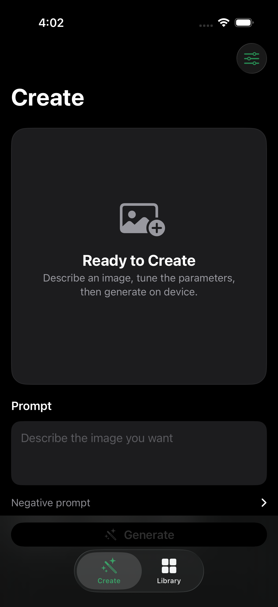

# Clover Image Tiny for iOS

Native, private image generation on iPhone with SwiftUI, Core ML, and
[Clover Image Tiny](https://huggingface.co/neonforestmist/Clover-Image-Tiny).



## Features

- Runs image generation on the device after model installation
- Apple-style SwiftUI interface for iPhone and iPad
- Prompt and negative-prompt controls
- 4–100 inference steps with both a slider and precise stepper
- Guidance from 1.0–20.0
- Reproducible seeds with seed randomization
- One to four images per generation
- PNDM and DPM-Solver++ schedulers
- NumPy and PyTorch-compatible random generators
- Neural Engine, automatic, and GPU compute modes
- Local artwork library and Photos export
- One shared model download containing the base and three LoRA style functions
- Visible downloads in **On My iPhone → Clover → Models**
- Immutable model revisions with byte-count and SHA-256 verification

Output resolution is fixed at 512 × 512 by the converted Core ML models.

## Requirements

- Xcode 16 or newer
- iOS 18 or newer
- A physical iPhone or iPad for Core ML image generation
- Enough free storage for the selected Core ML model

The repository and app bundle do not contain the model weights.

## Run the app

1. Clone this repository.
2. Open `Clover.xcodeproj`.
3. Select the `Clover` scheme and your Apple development team.
4. Choose a connected iPhone or iPad. Simulator is suitable for UI work.
5. Build and run.
6. Open **Models & Styles** in the app and download a model.

The app reads its versioned catalog from
[`neonforestmist/Clover-Image-Tiny-CoreML`](https://huggingface.co/neonforestmist/Clover-Image-Tiny-CoreML).
Installed files are checked against the catalog before use.
Downloaded files are visible in the Files app under
**On My iPhone → Clover → Models**. Existing downloads from earlier builds are
migrated into that folder when possible.

The iOS 18 model uses Core ML multifunction U-Nets. Clover's base weights are
stored once, while Monet, Pointillism, and Watercolor Anime remain separate
rank-16 adapter branches. Selecting a style loads its Core ML function; it does
not download or store another full U-Net.

## On-device behavior

After installation, prompts and generated images stay on the device. Network
access is used to refresh the catalog and download model files from Hugging
Face.

A physical device can use the Apple Neural Engine. The current Simulator
runtime rejects Core ML multifunction selection, so validate actual generation
on an iPhone or iPad. The first generation may take longer while Core ML
compiles and caches its graphs.

## Project structure

```text
Clover/
├── App/          App entry point and navigation
├── Features/     Create, model picker, settings, and library screens
├── Models/       Generation settings, artwork, and catalog types
├── Services/     Core ML inference, downloads, storage, and Photos export
└── Support/      Assets, colors, and app configuration
```

The app vendors the small Swift runtime from Apple's
[`ml-stable-diffusion`](https://github.com/apple/ml-stable-diffusion) project.
Its model loader is adapted to use `MLModelAsset`, which is required when
selecting an iOS 18 multifunction model. Apple's license is retained in the
vendored package.

## Regenerate the Xcode project

The checked-in project is generated from `project.yml` with
[XcodeGen](https://github.com/yonaskolb/XcodeGen):

```bash
brew install xcodegen
xcodegen generate
```

## License

The iOS source code in this repository is licensed under the
[Apache License 2.0](LICENSE).

Downloadable Clover Image Tiny model weights and derivative style models are
licensed separately under
[CreativeML Open RAIL-M](https://huggingface.co/neonforestmist/Clover-Image-Tiny/blob/main/LICENSE).
The Apache-2.0 license for this application does not relicense those model
weights. Third-party dependencies retain their respective licenses.
