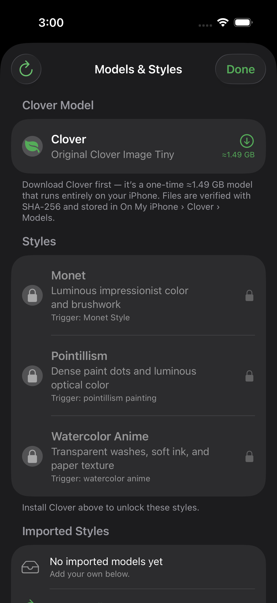
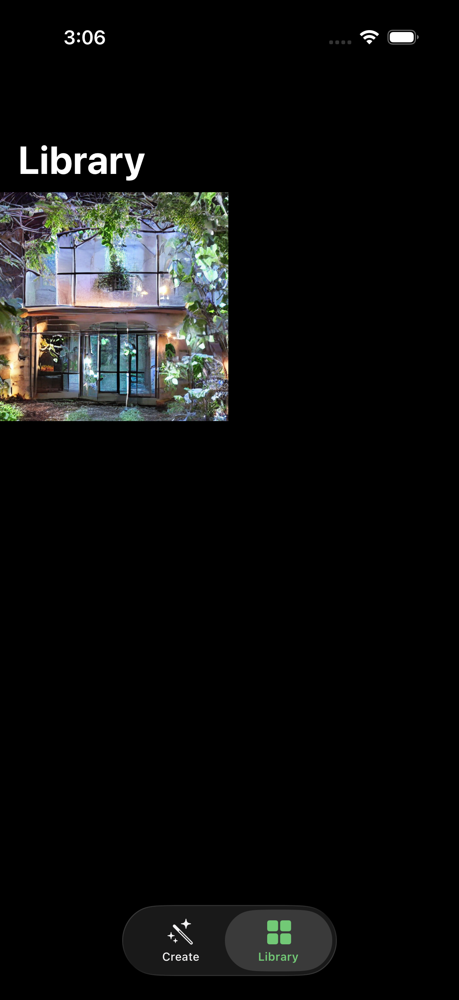

# Clover Image Tiny for iOS

Native, private image generation on iPhone with SwiftUI, Core ML, and
[Clover Image Tiny](https://huggingface.co/neonforestmist/Clover-Image-Tiny).

## Screenshots

| Create | Models & Styles | Library |
|:---:|:---:|:---:|
|  |  |  |
| On-device generation | Base first, styles opt-in | Saved artwork |

## Features

- Runs image generation on the device after model installation
- Apple-style SwiftUI interface for iPhone and iPad
- Prompt and negative-prompt controls
- 4–100 inference steps with both a slider and precise stepper
- Saved generation timelines with previews every 1–10 steps
- Guidance from 1.0–20.0
- Reproducible seeds with seed randomization
- One to four images per generation
- Native 512 × 512 output without post-generation cropping
- PNDM and DPM-Solver++ schedulers
- NumPy and PyTorch-compatible random generators
- Neural Engine, automatic, and GPU compute preferences
- Local artwork library and Photos export
- Base-first downloads: install Clover, then add only the styles you want
- Import a Clover-compatible `.safetensors` style from **On My iPhone → Clover → Imported Styles**
- Visible downloads in **On My iPhone → Clover → Models**
- Immutable model revisions with byte-count and SHA-256 verification

Output resolution is fixed at 512 × 512 by the converted Core ML models.

## Requirements

- Xcode 16 or newer
- iOS 18 or newer
- A physical iPhone or iPad for Core ML image generation
- Enough free storage for the selected Core ML model

The repository and app bundle do not contain the model weights.

## Run the app

1. Clone this repository.
2. Open `Clover.xcodeproj`.
3. Select the `Clover` scheme and your Apple development team.
4. Choose a connected iPhone or iPad. Simulator is suitable for UI work.
5. Build and run.
6. Open **Models & Styles** in the app and download a model.

The app reads its versioned catalog from
[`neonforestmist/Clover-Image-Tiny-CoreML`](https://huggingface.co/neonforestmist/Clover-Image-Tiny-CoreML).
Installed files are checked against the catalog before use.
Downloaded files are visible in the Files app under
**On My iPhone → Clover → Models**. Existing downloads from earlier builds are
migrated into that folder when possible.

Clover installs first: its shared components (text encoder, VAE, safety
checker, tokenizer) plus one stateful base U-Net, about 1.5 GB total. Monet,
Pointillism, and Watercolor Anime are then **optional 6,927,128-byte LoRA
style downloads**: `Monet.safetensors`, `Pointillism.safetensors`, and
`Watercolor-Anime.safetensors`. The Swift pipeline converts the selected style
weights to FP16 and loads them into the U-Net's mutable Core ML state; it never
downloads another ~648 MB U-Net. Each style comes from its compact
`-lora-coreml` Hugging Face repo, which contains only the named style weights,
state mapping, model card, and license. Styles stay locked until Clover is
installed. You can also side-load a Clover-compatible LoRA by placing its
`.safetensors` file directly in **On My iPhone → Clover → Imported Styles**.
The app detects the filename and loads its tensors into the installed Clover
U-Net. Older full Core ML model folders remain supported.

Output generation remains 512 × 512. The app can save centered 1:1, 4:5, 5:4,
9:16, 16:9, and custom width:height crops without downloading additional U-Net
variants.

## On-device behavior

After installation, prompts and generated images stay on the device. Network
access is used to refresh the catalog and download model files from Hugging
Face.

Live Step Previews render a lightweight RGB approximation directly from the
current denoising latent every 1–10 steps. This keeps the VAE decoder and safety
checker out of the denoising loop, avoiding repeated Core ML memory spikes on
iPhone; the finished image still uses the full VAE decoder. Preview frames are
stored as compressed JPEGs inside the finished artwork's folder. The Library
still shows one tile per final image; opening that image—or using the controls
below the newest Create output—reveals a slider for scrubbing through the saved
steps. Share and Save operate on the currently selected frame. The Library
detail screen can also download the complete timeline as a ZIP containing each
saved preview and the full-resolution final step. More frequent previews still
increase generation time, storage use, and battery use.

The stateful U-Net uses a batch-one input and runs classifier-free guidance in
two serial passes, cutting the largest activation peak roughly in half. It runs
with CPU and GPU compute because its mutable style buffers are not
execution-planned reliably on the Neural Engine. Other pipeline components
still honor the selected compute preference. Validate real generation on an
iPhone or iPad; the Simulator is suitable for UI testing. The first generation
may take longer while Core ML compiles and caches its graphs.

The current Core ML U-Net exposes one rank-16 mutable LoRA state, so Clover
applies one style per generation. Combining arbitrary rank-16 styles exactly
can require rank 32; supporting that safely needs a new rank-expanded Core ML
base export and catalog format rather than simply adding two adapter states.

## Project structure

```text
Clover/
├── App/          App entry point and navigation
├── Features/     Create, model picker, settings, and library screens
├── Models/       Generation settings, artwork, and catalog types
├── Services/     Core ML inference, downloads, storage, and Photos export
└── Support/      Assets, colors, and app configuration
```

The app vendors the small Swift runtime from Apple's
[`ml-stable-diffusion`](https://github.com/apple/ml-stable-diffusion) project.
Its model loader is adapted to create an iOS 18 `MLState`, populate 144 mutable
LoRA tensors from a standard Diffusers safetensors file, and keep that state for
every denoising step. Apple's license is retained in the vendored package.

The model-picker artwork comes from the MIT-licensed Phosphor collection via
Iconify. See [THIRD_PARTY_ASSETS.md](THIRD_PARTY_ASSETS.md) for attribution.

### Local safety-checker override

Safety checking is enabled by default. To disable it only for a local Xcode
run, duplicate the `Clover` scheme, make the duplicate unshared, then add this
Run argument:

```text
-DisableSafetyChecker YES
```

The unshared scheme is stored under `xcuserdata` and is not staged to GitHub.

## Regenerate the Xcode project

The checked-in project is generated from `project.yml` with
[XcodeGen](https://github.com/yonaskolb/XcodeGen):

```bash
brew install xcodegen
xcodegen generate
```

## License

The iOS source code in this repository is licensed under the
[Apache License 2.0](LICENSE).

Downloadable Clover Image Tiny model weights and derivative style models are
licensed separately under
[CreativeML Open RAIL-M](https://huggingface.co/neonforestmist/Clover-Image-Tiny/blob/main/LICENSE).
The Apache-2.0 license for this application does not relicense those model
weights. Third-party dependencies retain their respective licenses.
